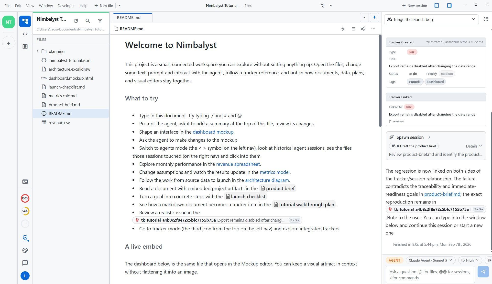
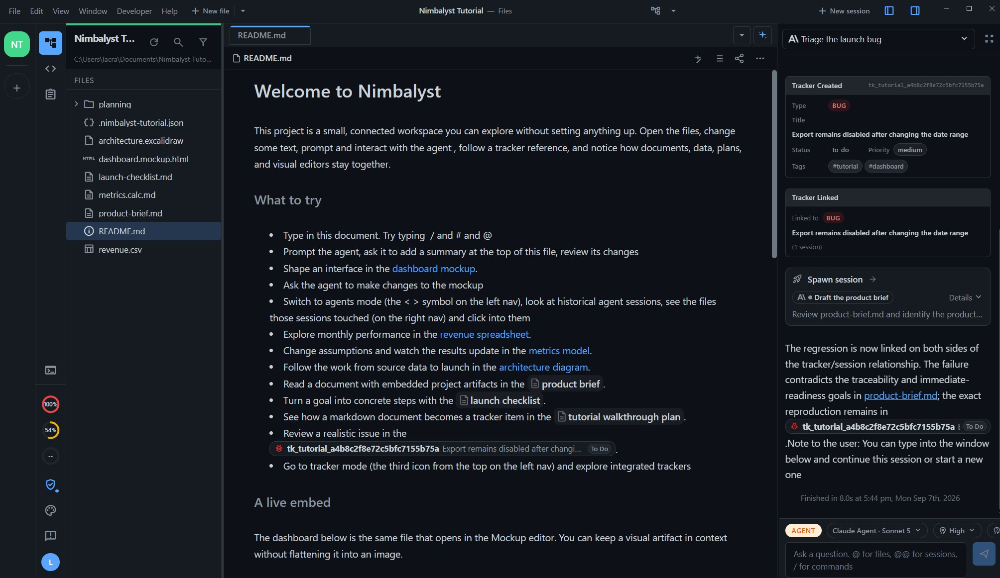
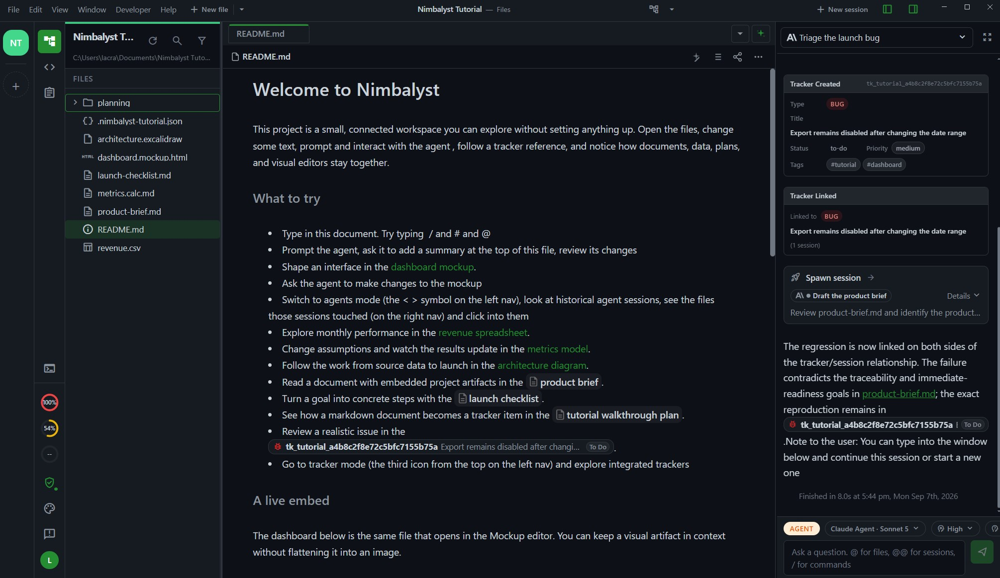

# GitHub Theme for Nimbalyst

Three color themes that bring GitHub's look to [Nimbalyst](https://nimbalyst.com), adapted from the [Obsidian GitHub Theme](https://github.com/krios2146/obsidian-theme-github) by [@krios2146](https://github.com/krios2146).

- **GitHub Light** - GitHub's light palette on a white background
- **GitHub Dark** - GitHub's dark palette on a `#0d1117` background
- **GitHub Dark Green** - the dark palette with a green `#258d32` accent instead of blue

All three cover the full editor UI, the Monaco code editor (background, syntax tokens, gutter, selection, and diff colors), blockquotes, tables, and the built-in terminal's 16-color ANSI palette.

## Install

In Nimbalyst, open **Settings > Extensions**, find **Install from GitHub**, and paste:

```
https://github.com/localhugdealer/nimbalyst-github-theme
```

Then pick **GitHub Light**, **GitHub Dark**, or **GitHub Dark Green** in **Settings > Appearance > Theme**.

Nimbalyst installs the latest release asset, or clones this repository if no release exists. There is nothing to build. this is a manifest-only extension.

<details>
<summary>Manual install</summary>

1. Download or clone this repository
2. Copy the folder into your Nimbalyst extensions directory:
  - Windows: `%APPDATA%\@nimbalyst\electron\extensions\`
  - macOS: `~/Library/Application Support/@nimbalyst/electron/extensions/`
  - Linux: `~/.config/@nimbalyst/electron/extensions/`
3. Restart Nimbalyst and choose the theme in Settings > Appearance
</details>

## Previews

### GitHub Light



### GitHub Dark



### GitHub Dark Green



## Palette

GitHub Light and GitHub Dark follow GitHub's Primer colors. GitHub Dark Green is the same dark palette with the blue accent swapped for green.

| Role | GitHub Light | GitHub Dark | GitHub Dark Green |
| --- | --- | --- | --- |
| Background | `#ffffff` | `#0d1117` | `#0d1117` |
| Secondary background | `#f6f8fa` | `#161b22` | `#161b22` |
| Text | `#24292f` | `#c9d1d9` | `#c9d1d9` |
| Muted text | `#57606a` | `#8b949e` | `#8b949e` |
| Border | `#d0d7de` | `#30363d` | `#30363d` |
| Accent / links | `#0969da` | `#58a6ff` | `#258d32` |
| Success | `#0cb54f` | `#7ee787` | `#7ee787` |
| Warning | `#bd8e37` | `#d29922` | `#d29922` |
| Error | `#cf222e` | `#f47067` | `#f47067` |


Open `samples/theme-preview.md` in Nimbalyst to see headings, code, diffs, tables, and blockquotes under any of the three themes.

## Customizing

Everything lives in `manifest.json` under `contributions.themes`. Each theme has a `colors` map for the app chrome and a `monaco` block (`base`, `rules`, `colors`) for the code editor. Without the `monaco` block Nimbalyst falls back to VS Code's `vs-dark`, which is why code files would otherwise show a `#1e1e1e` background. Edit a colour, restart Nimbalyst, and the change is live. The full set of supported color keys is broader than the SDK docs suggest and includes `code-*` syntax colours, `diff-*`, `table-*`, `toolbar-*`, and `terminal-*` entries; keys you omit are derived from the core palette.

## Credits

- Palette and original design: [Vladimir Kidyaev (@krios2146)](https://github.com/krios2146),  [Obsidian GitHub Theme](https://github.com/krios2146/obsidian-theme-github) (MIT)
- Underlying color system: [GitHub Primer](https://primer.style)

## License

[MIT](LICENSE)
